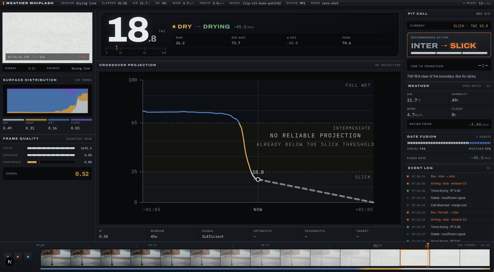

# Weather Whiplash

Track-surface intelligence for tyre decisions. Upload racing footage to classify the
surface, smooth it into a Track Wetness Index, detect whether conditions are changing,
and estimate when to pit.



## What it does

- Classifies each frame as `dry`, `damp`, `wet`, or `standing_water` with
  [`openai/clip-vit-base-patch32`](https://huggingface.co/openai/clip-vit-base-patch32).
- Derives `DRYING`, `WETTING`, or `STABLE` from the smoothed signal—not from a single
  image.
- Shows frame quality, uncertainty, weather fusion, crossover timing, and a hysteresis
  based tyre recommendation.

## Stack

FastAPI, PyTorch/Transformers, OpenCV, SQLite, and Next.js. The frontend and backend
remain separate processes connected over HTTP.

## Run locally

Requires Python 3.11+ and Node.js.

```bash
python3 -m venv .venv
.venv/bin/pip install -r backend/requirements.txt
cd frontend && npm ci && cd ..
```

```bash
# Terminal 1
cd backend && ../.venv/bin/python -m uvicorn app.main:app --port 8000

# Terminal 2
cd frontend && npm run dev
```

Open <http://localhost:3000>. The first backend start downloads and warms the model.

## Configuration and deployment

The application uses no runtime API key. Keep optional Hugging Face write tokens in
your ignored `.env` file or in your shell environment; use the committed
[.env.example](.env.example) only as a template. Deployment instructions for Hugging
Face Spaces and GitHub Pages are in
[docs/DEPLOYMENT.md](docs/DEPLOYMENT.md).

## Licence

[MIT](LICENSE). Dataset sources and attribution are documented in
[docs/DATASET.md](docs/DATASET.md). The compiled dataset is available on Hugging Face at [mrcreoid/weather-whiplash-surfaces](https://huggingface.co/datasets/mrcreoid/weather-whiplash-surfaces).
